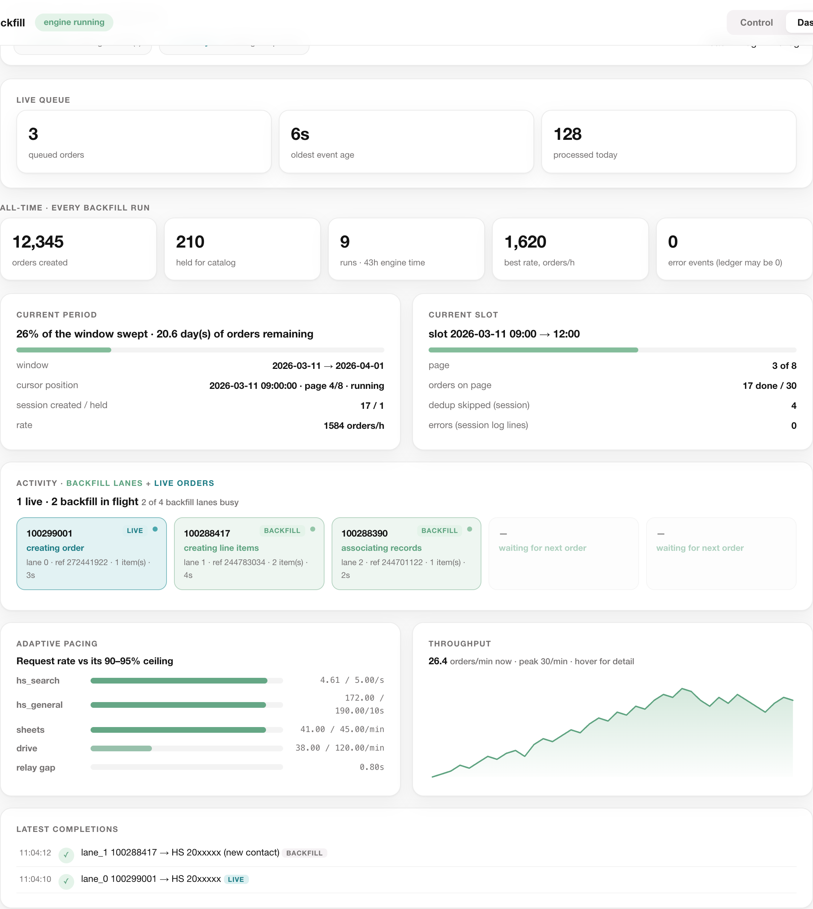
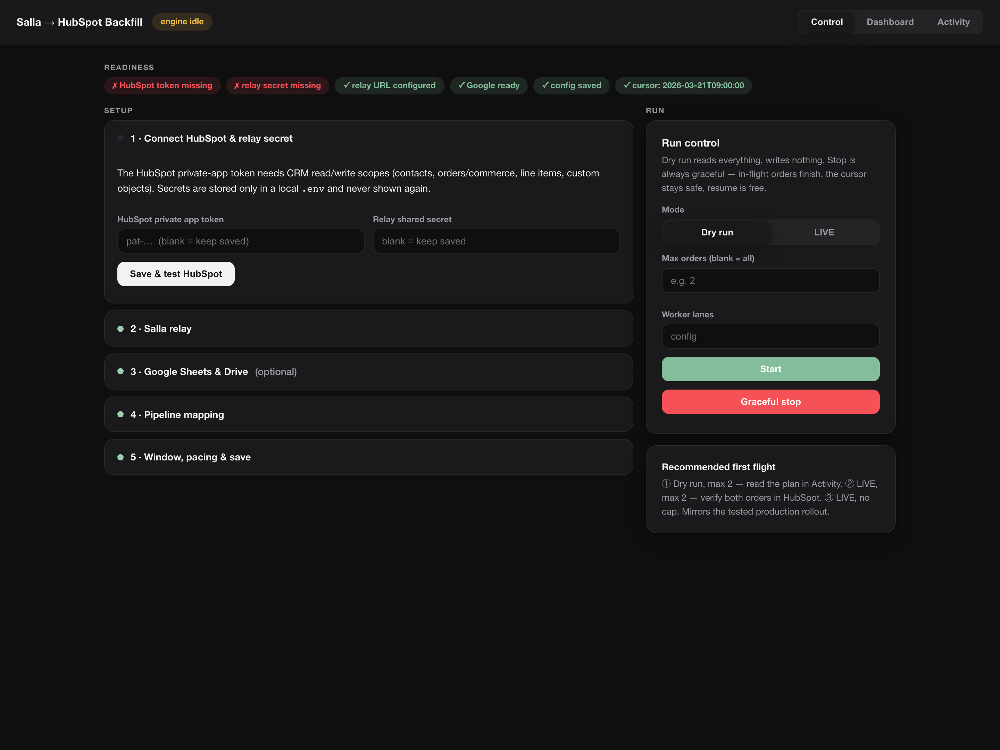
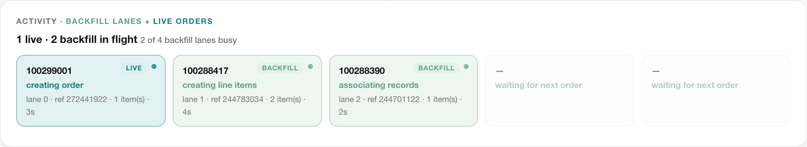
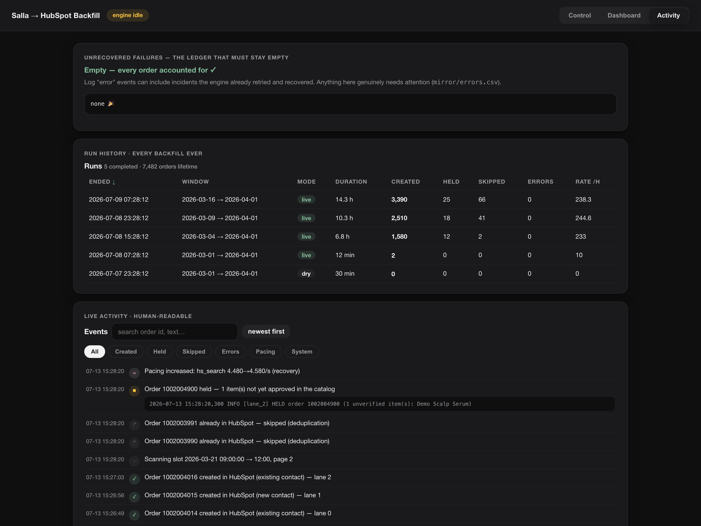

# Salla → HubSpot Order Backfill

A local, auditable engine that backfills historical **Salla** store orders into
**HubSpot** — contacts, orders, line items, and (optionally) product-bundle
custom objects — at a tiny fraction of the automation-platform cost that
usually makes large backfills impractical.

Born from a real production migration: tens of thousands of orders, a Make
scenario burning ~36 credits per order, and a plan that replaced it with this
engine at ~2.3 credits per order (~94% cheaper) while keeping a complete audit
trail. The engine has processed real stores end to end with per-slot
reconciliation against Salla's own counts.

**Two engines, one codebase:** a **backfill** that sweeps a historical window,
and a **live sync** that mirrors new orders 24/7 (§ [Live sync](#live-sync-mode-v18--247-order-syncing-without-the-big-scenario)).
They can run **together** and coordinate over the shared HubSpot rate budget.

> **Current version: v1.9.** For the full engineering deep-dive — how the relay,
> both engines, idempotency, adaptive pacing, and live-priority coordination fit
> together, plus a **real ~50× efficiency calculation with an interactive
> calculator** and **GCP deployment** — see **[docs/ARCHITECTURE.md](docs/ARCHITECTURE.md)**.



## How it works

```
             ┌──────────────────────────── your machine ────────────────────────────┐
Salla API ── Make "relay" (5 modules, reuses your existing Salla OAuth connection)  │
             │        │                                                             │
             │  cursor.json ── slot-by-slot sweep ── dedup vs HubSpot ── create:    │
             │        │        (3h windows)          (salla_order_id)   contact →   │
             │        │                                                order →      │
             │  backfill.log · mirror/*.csv · archive/*.json           line items → │
             │  (full audit trail, always on)                          bundles      │
             └───────────────────────────────────────────────────────── HubSpot API ┘
```

- **Relay, not OAuth surgery:** Salla's Merchant API is OAuth-app-only. Instead
  of new credentials, a 5-module Make scenario (blueprint included) proxies
  read-only Salla calls through the Salla connection you already have. A few
  Make operations per batch instead of dozens per order.
- **Resumable by construction:** the cursor advances only after a page fully
  processes. Kill it, reboot, resume — deduplication makes rescans free and
  duplicates impossible (every order is checked by `salla_order_id` before any
  write).
- **Guardrails everywhere:** dry-run by default, typed `RUN` confirmation for
  live mode, `--max-orders` test gates, graceful STOP file, client-side rate
  limiting (HubSpot search cap shared with your live automations), exponential
  backoff, a contact-create race guardrail (concurrent live flows can win the
  race between search and create — the engine waits, re-searches, and adopts
  the winner), status-aware pipeline staging, and an unrecovered-failure
  ledger that stays empty or gets loud.

## Quick start

```bash
git clone https://github.com/YahyaElghobashy/salla-hubspot-backfill.git
cd salla-hubspot-backfill
python3 -m venv venv
./venv/bin/pip install -r requirements.txt     # Windows: venv\Scripts\pip install -r requirements.txt
./venv/bin/python serve.py                     # Windows: venv\Scripts\python serve.py
```

`serve.py` opens the **web UI** (any modern browser, macOS / Windows / Linux):

1. **Control** — the five-step setup wizard (credentials, relay, Google,
   status→stage mapping, window + pacing) and the run panel side by side:
   dry run → capped live test → full run, graceful stop any time.
2. **Dashboard** — lifetime metrics, current period and slot, live worker
   lanes, adaptive-pacing bars, and a hoverable throughput line chart.
3. **Activity** — the failure ledger, a sortable history of every run ever,
   and the log as filterable human-readable events.

Prefer terminals? Everything works without the UI:

```bash
./venv/bin/python run.py --dry --max-orders 2      # dry run gate
./venv/bin/python run.py --live --max-orders 2     # live gate (type RUN)
./venv/bin/python run.py --live                    # full run, supervised + keep-awake
./venv/bin/python dashboard.py                     # rich TUI dashboard in a second terminal
```

`run.py` is the cross-platform supervisor: keeps the machine awake
(macOS `caffeinate` / Windows `SetThreadExecutionState` / Linux
`systemd-inhibit`), relaunches the engine if it's killed abnormally, and stops
cleanly on the STOP file or when the cursor reaches `done`.

## The web UI, page by page

Everything runs locally (`python serve.py`), talks only to your own HubSpot
portal, Make relay, and Google account, and never sends data anywhere else.
Three pages: **Control** to set up and launch, **Dashboard** to watch,
**Activity** to audit. All screenshots use synthetic demo data.

### Control — set up and run from one place



The readiness strip at the top tells you at a glance what is still missing
before a run can start. Below it, the five setup steps live in collapsible
cards — each with a status dot — and the sticky **Run** panel sits beside
them so configuration and launch never drift apart:

1. **Connect** — HubSpot private-app token + relay secret. Stored only in a
   local `.env` (0600), never echoed back; the button live-tests the token.
2. **Salla relay** — paste the Make webhook URL; the test pulls your store's
   order-status list through it, proving the entire relay path.
3. **Google Sheets & Drive** *(optional)* — live audit sheet + JSON archive,
   or skip and rely on the always-on local CSV mirrors.
4. **Pipeline mapping** — pulls your portal's stages and your store's
   statuses; click the status→stage map together.
5. **Window, pacing & save** — date range, worker lanes, adaptive-pacing
   limits (safe defaults match the documented quotas), validated through
   the engine's own loader.

The Run panel: **Dry run** is the default and writes nothing; **LIVE** only
arms after you type `RUN`; max-orders gives cheap test gates; stop is always
graceful (in-flight orders finish, the cursor stays safe, resume is free).

### Dashboard — both engines, every lane and limit, live (v1.9 consolidated)


- **Both engines at once** — the dashboard streams `backfill.log` **and**
  `live.log` together (no toggle). Each engine has its own live status pill:
  *backfill* creating/scanning, *live sync* working/watching.
- **All-time strip** — lifetime metrics across *every* backfill run ever:
  orders created, held, run count and engine hours, best rate.
- **Current period** — how much of the configured window is swept, cursor
  position, session counts, live rate.
- **Current slot** — the exact time-slot and page being processed right now.
  A skip-heavy slot reads as **"scanning"**, not idle — a working engine never
  looks dead.
- **Color-coded activity** — one card per unit of work: **backfill** worker
  lanes in light green, **live-order** cards in deep blue-green (sorted first),
  each showing the order it carries, its live phase, and its age:

  
- **Adaptive pacing** — request rate vs the 90–95% ceiling per provider.
  The bars deepen toward sage green as utilization rises: **a full bar is
  the goal** (full utility), not a warning. Throttle events appear in the
  ticker below.
- **Throughput** — a continuous line chart of orders/minute, live-updating;
  hover anywhere for the exact minute and count.

### Activity — the human-readable history of everything



- **Unrecovered failures** — the ledger that must stay empty, front and
  center. Log "errors" can be recovered incidents; this cannot.
- **Run history** — every backfill ever, parsed from the log: window, mode,
  duration, created/held/skipped/errors, rate. Click any column to sort.
- **Events** — the log translated into plain sentences ("Order X created in
  HubSpot (new contact) — lane 2"), with filter chips (created / held /
  skipped / errors / pacing / system), free-text search, newest/oldest
  toggle, and click-to-expand raw log lines for any event.
- **Raw log tail** — still there for debugging, one click away.

## The Make relay (one-time, ~5 minutes)

1. Open `relay/relay_blueprint.template.json`, replace
   `RELAY_SECRET_REPLACE_ME` (2 places) with a long random string.
2. Make → Scenarios → Create → Import Blueprint → pick the file. Create the
   webhook when prompted; select **your existing Salla connection** on both
   Salla modules.
3. Turn it ON, copy the webhook URL into the wizard. Idle cost is zero; it
   only spends operations when the engine calls it.

## What gets written where

| Destination | Content |
|---|---|
| HubSpot | contacts (searched by phone first, race-guarded), orders (30+ properties incl. totals, payment, status-mapped pipeline stage), line items with product stamps, optional bundle records with full associations |
| Local `archive/` | the raw Salla JSON of every processed order |
| Local `mirror/` | CSV mirror of every audit/queue row + `errors.csv`, the unrecovered-failure ledger |
| Google Sheets / Drive (optional) | live audit rows and JSON archive uploads, if you enable them in the wizard |

**Privacy note:** `archive/`, `mirror/`, and logs contain customer data. They
are gitignored; keep them local.

## Live sync mode (v1.8) — 24/7 order syncing without the big scenario

The same engine that backfills history can replace your live "order
created" automation. Instead of a 25-40-op Make scenario per order, a
**2-op intake scenario** (`relay/live_intake_blueprint.template.json`:
Salla trigger → append one row) writes every new order's id to a dedicated
**Live Queue spreadsheet**, and the engine's live mode consumes it:

```bash
python live.py --init-queue      # one-time: creates the queue spreadsheet
python live.py --once            # dry run: one poll cycle, plan only
python run.py --mode live --live # the 24/7 service (restarts forever)
```

Poll (every **5 s** by default) → claim queued rows → fetch full orders through
the relay → the exact same worker-lane pipeline as the backfill (dedup, catalog
gate, contact guardrails, bundles, audit trail, adaptive pacing) → write
`done/held/error/gone` back to the row.

**Live status + bursts (v1.8):** when several orders land in one poll window,
the whole batch is stamped **`processing`** at once — the Live Queue sheet shows
exactly which orders are in flight vs done — then drained through the lanes, each
row flipping to its terminal state as its lane finishes. The loop is synchronous,
so the next poll can never re-claim an in-flight row. To keep the 5 s poll honest,
the full single-consumer heartbeat cycle is decoupled to run only every ~25 s, so
most polls do a single queue read.

Durability (nothing lost, nothing duplicated — by construction):

- **Engine down** → rows accumulate in the sheet; restart consumes them.
- **Make credits exhausted / intake off** → Make's webhook queue buffers
  and replays on recovery (the relay stalls too: lossless wait).
- **HubSpot's search index lags fresh objects** → a persistent local
  created-ledger plus a duplicate-rejection guardrail on order create make
  reprocessing idempotent even when search can't see the order yet.
- **Webhook missed an event** → an hourly reconciliation sweep lists the
  recent window via the relay and *appends* missing ids to the queue
  (single consumer path — the sweep never writes to HubSpot itself).
- **Two instances by mistake** → an OS file lock plus a heartbeat cell in
  the queue sheet make the second consumer refuse to claim.
- **Crash mid-order** → a row left `processing` by a dead predecessor is
  reclaimed on restart (v1.8); the pre-existing check (ledger + line-item
  verification) finishes or repairs it — idempotently, so never a duplicate.

Ops per order: ~2 (intake) + ~1-2 amortized (relay fetch) vs 25-40 in a
full Make scenario — the same ~92-94% credit cut as the backfill.
[`docs/ARCHITECTURE.md`](docs/ARCHITECTURE.md) covers the full live-sync design,
running it as a **systemd service on GCP**, and the coordination that lets the
backfill and live engines run together on one HubSpot rate budget. The web
dashboard shows the live queue and both engines in one consolidated view.

## Concurrent worker lanes (v1.5)

One order is ~13 sequential API round-trips, so a single-lane engine is
bound by network latency (~200 orders/h measured), not by quotas — the
documented limits allow ~1,600-1,800/h. v1.5 processes each page with N
**worker lanes** (`workers` in config, `--workers` on the CLI, or the Run
tab): different orders in flight simultaneously, all sharing the same
global adaptive limiters, so N lanes are collectively paced to exactly the
budget one lane would get.

What stays guaranteed (the invariants concurrency must not break):

- **No duplicates** — every order is still dedup-checked before any write,
  each order is owned by exactly one lane, and pages never overlap (the
  cursor advances only after the whole page drains).
- **No cross-lane contact races** — contact search→create→guardrail runs
  inside a per-customer lock; two lanes carrying the same buyer serialize
  for that step only. The v1.1 guardrail still covers races against your
  live automations.
- **Nothing silently dropped** — a lane failure lands in
  `mirror/errors.csv` with the salla order id (same as the sequential
  engine), the run summary prints a loud UNRECOVERED FAILURES banner when
  the ledger is non-empty, and stopping (STOP file / Ctrl-C) waits only
  for the in-flight orders — never abandons them.
- **Resume identical** — kill it anywhere; the page rescan on restart is
  free (dedup) and the cursor was never advanced past unfinished work.

Sizing: lanes saturate around **3-4** (the account-wide HubSpot search
ceiling is the wall); the engine clamps at 8. Measured on a production
store: 3 lanes ≈ 3x the single-lane rate at identical pacing ceilings.
Audit-trail note: sheet rows interleave across lanes; row integrity is
preserved because each lane updates only the row number its own append
returned.

## Live-priority pacing (v1.7)

When the live-sync service and a backfill run share one HubSpot account,
they coordinate so **fresh orders always win**. The live engine writes a
tiny `mirror/live_active.json` signal each poll; the backfill reads it at
every page and **yields its HubSpot search/general budget** (down to
`hs_search_yield_per_s`, e.g. 0.6/s) whenever live has orders, then
**reclaims the full 90-95% ceiling** the moment live is idle (or its signal
goes stale, i.e. the live engine stopped). The cursor is untouched, so the
backfill is only *paced* slower during live bursts, never skipped — and no
live order waits. AIMD 429-backoff remains the ultimate guardrail if the
combined estimate is ever off.

## Adaptive rate pacing (v1.4)

The engine paces itself per destination with an AIMD controller (additive
increase, multiplicative decrease — the same family TCP uses), targeting
**90–95% of each provider's documented limit** and never more:

| Bucket | Documented limit | Default ceiling (×0.92) | Feedback signals |
|---|---|---|---|
| HubSpot search | 5 req/s **per account** | 4.6/s | 429s only (search responses carry no rate headers) |
| HubSpot general | 190 req/10s per private app (Pro/Ent) | 17.5/s | 429s + `X-HubSpot-RateLimit-Max/-Remaining` (10s window) |
| Sheets writes | 60 req/min/user (fixed ~60s window) | 55/min | 429s, 65s cooldown so the window refills |
| Drive uploads | 325k units/min/user (create = 50 units) | 120/min (self-imposed) | 429/403 rate errors |
| Make relay | webhook 300 req/10s; scenario latency dominates | gap ≥ `relay_floor_interval_s` | transient/async-ACK responses widen the gap |

How it behaves: rates start at your configured `*_per_s` / `*_per_min`
values, climb slowly after sustained clean streaks, halve immediately on a
429 (then cool down before growing again), and yield gently when HubSpot's
shared-bucket headers show other integrations draining the same pool. Every
change is logged as an `ADAPT` line and a `RATES` snapshot appears about
once a minute (both dashboards display it live).

Sharing the portal with live automations? The 5/s search pool is
account-wide — set `hs_search_limit_per_s` to your fair share of it (e.g.
`3.0` if a live integration needs the rest). Set `adaptive_enabled: false`
to pin every rate at its starting value (pre-v1.4 behavior).

## Verification tools

- `tools/qa_spot_check.py N` — random-sample deep verification of created
  orders against HubSpot and the local archive (dedup integrity, naming,
  stage, totals, contact + line-item associations).
- `tools/retro_status.py` — retroactive stage sweep: re-stages already-created
  orders from their current Salla status (batched 100/call), with sample-first
  and dry-run modes. See `--help`.

## FAQ

**Is this a server?** No. Outbound HTTPS only. Close the lid and it stops
cleanly; run again and it resumes.

**Can it duplicate orders?** Every order is looked up by `salla_order_id`
before any write, and the cursor never skips work. Kill -9 mid-page costs a
few read-only skips on resume, nothing else.

**What about my live automations?** The default HubSpot search pacing
(3.5/s of the account-wide 5/s) deliberately leaves headroom for them.

**Windows?** Yes — pure Python 3.9+, no shell scripts in the critical path.

## License

MIT
