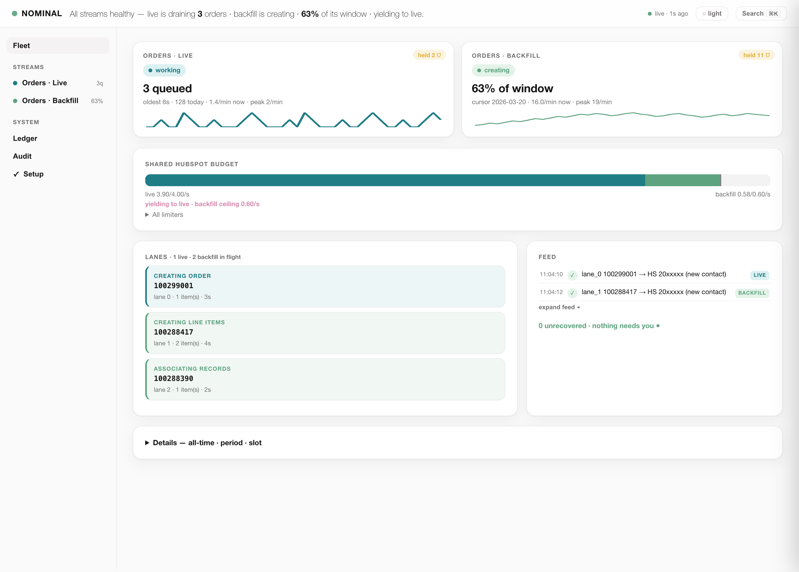

# Salla → HubSpot — Architecture & Engineering Deep-Dive

A local, resumable, self-pacing engine that mirrors a Salla store's orders into
HubSpot CRM — both **historically** (the backfill) and **in real time** (live
sync) — with idempotency, adaptive rate-limiting, concurrent worker lanes, and a
live web dashboard. This document explains how every piece works, why it is built
the way it is, and includes a **real efficiency calculation** (~50× vs manual
entry) with an interactive calculator.

> **Version:** v1.9 · Python 3.11+ · stdlib HTTP + Google API client · Flask UI

---

## 1. The problem, in one paragraph

Salla (the storefront) and HubSpot (the CRM) don't share an order model. Every
Salla order must become, in HubSpot: a **contact** (deduplicated by phone/email),
an **order** object (amount, currency, payment method, pipeline stage), one
**line item** per product (with the product linked and bundles expanded into
parent + component line items), and the **associations** between them — plus an
audit trail. Doing this for tens of thousands of historical orders, and then for
every new order forever, by hand is infeasible. This engine does it.

---

## 2. The hybrid architecture: why a relay exists

The engine **cannot call Salla directly** — it holds no Salla OAuth credentials.
Salla's API is reached through a thin **Make.com relay** that owns the Salla
connection and does nothing but proxy requests. Everything else — HubSpot writes,
Google Sheets/Drive, all business logic, pacing, idempotency — lives in the local
engine.

```
                       ┌──────────────────────────────────────────┐
                       │              LOCAL ENGINE                 │
   ┌─────────┐  HTTP   │  backfill.py · live.py                    │  HTTPS   ┌──────────┐
   │  Make   │◀────────│  • dedup / gate / create / associate      │─────────▶│ HubSpot  │
   │  relay  │  (order │  • adaptive limiters (AIMD)               │  (CRM)   │   CRM    │
   │ (Salla) │  fetch) │  • worker lanes (ThreadPoolExecutor)      │          └──────────┘
   └────▲────┘         │  • idempotency ledger + dedup search      │          ┌──────────┐
        │              │  • cursor / queue state machines          │─────────▶│  Google  │
   ┌────┴────┐ webhook │                                           │  (audit) │ Sheets + │
   │  Salla  │────────▶│  Two engines share this codebase:         │          │  Drive   │
   │  store  │  (new   │   ▸ backfill  = historical window sweep   │          └──────────┘
   └─────────┘  order) │   ▸ live sync = 24/7 queue consumer       │
                       └──────────────────────────────────────────┘
```

Two things flow through the relay:

| Path | Direction | Purpose |
|------|-----------|---------|
| **Order fetch** | engine → relay → Salla | `GET orders/{id}?expanded=true`, batched, for both engines |
| **Live intake** | Salla → Make → Google Sheet | `salla:WhenOrderCreated` webhook appends a row to the *Live Queue* sheet |

The relay is deliberately dumb. It has no business logic, so it can't drift from
the engine and can't create duplicates.

---

## 3. Shared foundations (both engines)

Both engines are the **same `Engine` class** in `backfill.py`. Live sync is a
subclass (`LiveEngine`) that swaps the cursor/page loop for a queue loop but
reuses every guardrail below.

### 3.1 Adaptive AIMD pacing

Each rate limit is an `AdaptiveLimiter` that drives its request rate toward
**90–95 % of the provider's documented ceiling** using AIMD (additive-increase,
multiplicative-decrease — the same control law as TCP congestion):

- **Additive increase:** on success, nudge the rate up by a small step.
- **Multiplicative decrease:** on a `429` (or a rate-limit header signalling low
  headroom), cut the rate hard and enter a cooldown.

The documented ceilings (verified against HubSpot's usage guidelines):

| Bucket | Documented limit | Scope | Notes |
|--------|------------------|-------|-------|
| HubSpot **search** | **5 req/s** | **per account** | shared with *every* integration on the portal; no rate headers → adapts on 429s alone |
| HubSpot **general** | 190 req/10s | per private app | carries `X-HubSpot-RateLimit-*` headers used as a headroom signal |
| Google **Sheets** | 60 read/min + 60 write/min | per user | reads and writes are *separate* buckets |
| Google **Drive** | ~120/min effective | per user | JSON backups |

The **HubSpot search cap (5/s, account-wide) is the system's true bottleneck** —
everything else has slack. Section 7 turns this into the efficiency number.

### 3.2 Concurrent worker lanes

A page (backfill) or a poll batch (live) fans out over `workers` lanes — a
`ThreadPoolExecutor` — that **share the global limiters**. N lanes never exceed
one lane's rate budget; concurrency hides per-order latency (network + Google +
HubSpot round-trips) *behind* the rate ceiling instead of stacking on top of it.
Result: ~3× throughput at identical rate ceilings versus a single lane.

### 3.3 Idempotency — nothing is ever created twice

Three layers, checked in order:

1. **Created ledger** (`mirror/created.csv`): an append-only
   `salla_order_id → hubspot_order_id` map, written the instant a create fully
   succeeds. Consulted *first* because HubSpot's search index is eventually
   consistent (a fresh object takes seconds-to-minutes to become searchable).
2. **Dedup search**: if not in the ledger, search HubSpot for the order.
3. **Duplicate-400 guardrail**: if a create races and HubSpot returns a
   duplicate error, the engine recovers the existing id instead of retrying.

A pre-existing order found by search but *not* in the ledger is **verified**
(its HubSpot line-item count must be ≥ the source order's item count) before it
is trusted — so a crash-partial is repaired, not silently accepted.

### 3.4 Guardrail philosophy

- **Nothing fake-succeeds.** A network/DNS failure *raises* — the order errors
  loudly and is retried; it never falls through to "not found → create" (which
  would duplicate).
- **Nothing is dropped silently.** Every order ends in an explicit terminal
  state: `done`, `held` (catalog gate), `error`, or `gone`.
- **Every write is mirrored locally** (`mirror/*.csv`) so the ground truth
  survives a Sheets outage.

### 3.5 DNS cache (v1.9)

`http_request` opens a fresh connection per API call, each doing a `getaddrinfo`.
Running the backfill (4 lanes) and live sync (2 lanes) **together** opens enough
short-lived connections to flood the OS resolver, which then intermittently
returns `EAI_NONAME`. A process-wide `getaddrinfo` TTL cache (300 s) collapses
the handful of API hostnames to one lookup each. Only *successful* lookups are
cached; failures fall through, so a genuine DNS outage still surfaces.

---

## 4. The backfill engine

Sweeps a historical date window and creates every missing order.

### 4.1 Cursor → slots → pages

The window (e.g. `2026-03-04 → 2026-04-01`) is walked in **slots** of
`slot_hours` (default 3 h). Each slot is paged (`per_page`, default 30). The
**cursor** (`cursor.json`) records the current slot + page + status and is
written atomically after each page. Because the cursor advances **only after a
whole page drains**, a crash mid-page simply re-scans that page on resume — and
because of idempotency, re-scanning already-created orders is *free* (they skip).

### 4.2 Per-order pipeline

```
dedup ─▶ fetch full order (relay) ─▶ archive JSON ─▶ audit "arrived" row
      ─▶ catalog gate ─┬─ unverified item ─▶ HELD (review queue)
                       └─ all approved   ─▶ CREATE:
                              contact (search→create/merge)
                              order object (properties, pipeline stage)
                              line items (one per product; bundles expand)
                              associations (contact↔order, order↔line items)
                              audit "created" row + Drive JSON backup
                              ledger.add(salla_id → hs_id)
```

### 4.3 Catalog gate

Before creating, each item is checked against the HubSpot catalog: is the product
**approved**? does it map to an **active bundle template**? An order with any
unapproved/inactive item is **held** (parked in a review queue, not dropped) so a
human can approve the catalog entry; on the next pass the held order sails
through. This is why "held" is a healthy state, not an error.

---

## 5. The live-sync engine (24/7)

Replaces the old per-order Make scenario. A single long-running process consumes
the *Live Queue* sheet that the intake webhook fills.

### 5.1 Queue row lifecycle

```
queued ─▶ processing ─▶ done         (created in HubSpot, ledger updated)
                     ├▶ held         (catalog gate)
                     ├▶ error        (retried on a slower cadence)
                     └▶ gone         (relay returned nothing after N attempts)
```

### 5.2 The poll loop

```
every live_poll_s (default 5s):
  heartbeat check (throttled — see 5.4)
  read queue  ─▶  claim (queued + reclaimable) ─▶ collapse duplicate ids
             ─▶  resolve pre-existing (ledger + LI verify) ─▶ skip
             ─▶  fetch remaining (relay, batched)
             ─▶  process_batch:  mark ALL 'processing'  ▸  drain 2 lanes  ▸  mark each done/held/error
             ─▶  publish live_active.json (coordination signal)
  (hourly) sweep: list recent window, enqueue any id nobody has seen
```

### 5.3 Bursts — many orders in one poll (v1.8)

When several orders land in a single 5 s window, the whole batch is stamped
**`processing`** at once (so the sheet shows exactly what's in flight), then
drained through the lanes; each row flips to its terminal state as its lane
finishes. The loop is **synchronous** — `process_batch` blocks until the batch
fully drains — so the *next* poll can never re-claim a still-in-flight row.

**Crash recovery:** a `processing` row left behind by a *crashed* predecessor is
reclaimable on restart. This is safe precisely because of idempotency (§3.3): a
re-run of an already-created order is a skip, never a duplicate.

### 5.4 Single-consumer guarantee

Two consumers of one queue = duplicate risk. Two guards prevent it:

- **`flock`** on `live.lock` — stops a second instance on the *same machine*.
- **Heartbeat cell** (sheet `J1`) — a foreign hostname's fresh heartbeat makes a
  new instance refuse to claim. A *stale same-machine* heartbeat is a dead
  predecessor (the flock proves no live peer), so the new instance takes over
  immediately instead of waiting out the staleness window.

In v1.8 the full heartbeat cycle (read + check + write) runs at most every ~25 s,
so most polls do a single queue read — that's what lets the 5 s poll interval
deliver ~5 s latency instead of paying two extra Sheets round-trips every cycle.

### 5.5 Live orders are tagged, not mistaken for backfill (v1.9)

The audit + queue-log "Older Backfill?" column now reads **`No`** for live
orders and **`Yes`** for backfill runs (`is_live_sync` flag), so the two streams
are distinguishable downstream.

---

## 6. Live-priority coordination — running both at once (v1.7)

The backfill and live engines share one HubSpot account (one 5/s search pool).
They coordinate through a file:

- The live engine writes `mirror/live_active.json` every poll (`active`, `depth`).
- The backfill reads it each page. When live is **active**, backfill drops its
  HubSpot ceilings to a small reserve (search → 0.6/s) so live gets the budget;
  when live goes **idle**, backfill reclaims full speed (search → ~4.6/s) via
  AIMD ramp-up.

**Measured (45-min coordinated dual-run):** `bf_ceil` rode the full **0.60 ↔
4.60 req/s** swing as live orders arrived and drained; **0 errors**; live never
starved, backfill never stalled — it created **310 orders in 45 min** *while*
yielding. Standalone (no yielding) the backfill averages ~1,000 orders/h.

---

## 7. Efficiency — the real ~50× calculation

### 7.1 Where the number comes from

The honest baseline is **manual data entry** — a person recreating each Salla
order in HubSpot through the UI:

| Manual step (HubSpot UI) | Time |
|--------------------------|------|
| Resolve contact (search, dedupe, create) | ~45 s |
| Create order object + set properties | ~40 s |
| Create line items, link products (~1.5 items) | ~45 s |
| Associate contact ↔ order ↔ line items | ~20 s |
| Log audit row + back up the order JSON | ~30 s |
| **Total** | **~180 s = 3 min/order → ~20 orders/h** |

The engine's **measured** sustained throughput is **~1,000 orders/h** (all-time:
42,802 orders created in ~42.5 h of engine time — this *includes* skips, held
orders, dry runs, and resume re-scans; the documented pure-create ceiling is
~1,600–1,800 orders/h).

```
        engine 1,000 orders/h
speedup = ───────────────────── ≈ 50×
        manual 20 orders/h
```

Cross-check on the real corpus of **42,802 orders**:

| | Manual (@3 min) | Engine |
|---|---|---|
| Wall-clock | 42,802 × 3 min = **2,140 h** ≈ 267 work-days (8 h) | **~42.5 h** |
| Ratio | | **≈ 50×** |

### 7.2 Why the engine reaches 1,000/h (the engineering layers)

The 50× is not "computer vs human" magic — it's the compounding of concrete
optimizations. Versus a *naive* single-lane, fixed-conservative-rate script:

| Optimization | Gain | Mechanism |
|--------------|------|-----------|
| Concurrent lanes (4) | **~3×** | hide per-order latency behind the rate ceiling |
| Adaptive pacing (92 % util vs ~50 % safe-fixed) | **~1.85×** | AIMD rides the real ceiling instead of a timid guess |
| Idempotent skip on re-runs | re-scans ≈ free | ledger + dedup; a resume costs nothing |
| DNS cache + coordination | sustains the above under dual-engine load | no resolver stalls, no mutual starvation |

Naive script ≈ 180 orders/h → **× ~5.5 engineering** → engine ≈ 1,000 orders/h →
**vs manual 20/h = ~50×** end-to-end.

### 7.3 Interactive calculator

Drop this self-contained block into any docs page (renders in MkDocs/Docusaurus/
plain HTML). Adjust the inputs; the multiplier and hours/cost saved recompute
live.

```html
<div id="eff-calc" style="font:14px/1.5 system-ui,sans-serif;max-width:560px;border:1px solid #e5e5e5;border-radius:14px;padding:18px 20px">
  <h4 style="margin:0 0 12px">Efficiency calculator — Salla → HubSpot engine</h4>
  <label>Orders to migrate <b id="oc-v">42,802</b><br>
    <input id="oc" type="range" min="100" max="200000" step="100" value="42802" style="width:100%"></label>
  <label>Manual time per order (min) <b id="mm-v">3.0</b><br>
    <input id="mm" type="range" min="1" max="8" step="0.5" value="3" style="width:100%"></label>
  <label>Engine throughput (orders/h) <b id="th-v">1000</b><br>
    <input id="th" type="range" min="200" max="1800" step="50" value="1000" style="width:100%"></label>
  <label>Loaded labor cost ($/h) <b id="lc-v">25</b><br>
    <input id="lc" type="range" min="5" max="80" step="1" value="25" style="width:100%"></label>
  <hr style="border:none;border-top:1px solid #eee;margin:14px 0">
  <div style="display:grid;grid-template-columns:1fr 1fr;gap:8px 16px">
    <div>Manual time</div><div style="text-align:right"><b id="r-manual">–</b></div>
    <div>Engine time</div><div style="text-align:right"><b id="r-engine">–</b></div>
    <div>Speed-up</div><div style="text-align:right;color:#1f7d86"><b id="r-mult">–</b></div>
    <div>Hours saved</div><div style="text-align:right"><b id="r-saved">–</b></div>
    <div>Labor cost avoided</div><div style="text-align:right"><b id="r-cost">–</b></div>
  </div>
  <script>(function(){
    var $=function(i){return document.getElementById(i)};
    function fmt(h){return h>=8?(h/8).toFixed(1)+' work-days':h.toFixed(1)+' h'}
    function calc(){
      var oc=+$('oc').value, mm=+$('mm').value, th=+$('th').value, lc=+$('lc').value;
      $('oc-v').textContent=oc.toLocaleString(); $('mm-v').textContent=mm.toFixed(1);
      $('th-v').textContent=th; $('lc-v').textContent=lc;
      var manualH=oc*mm/60, engineH=oc/th, mult=manualH/engineH, saved=manualH-engineH;
      $('r-manual').textContent=fmt(manualH);
      $('r-engine').textContent=fmt(engineH);
      $('r-mult').textContent=mult.toFixed(1)+'×';
      $('r-saved').textContent=fmt(saved);
      $('r-cost').textContent='$'+Math.round(saved*lc).toLocaleString();
    }
    ['oc','mm','th','lc'].forEach(function(i){$(i).addEventListener('input',calc)});calc();
  })();</script>
</div>
```

Defaults (42,802 orders · 3 min/order · 1,000 orders/h · $25/h) yield **≈ 50×**,
**~2,097 hours saved**, **~$52,000 labor avoided**.

---

## 8. The web dashboard — "Quiet Fleet" (v2.0)

`serve.py` launches a Flask UI (`http://127.0.0.1:8377`). v2.0 replaced the
three-tab layout with a **stream-object shell** (design rationale:
[`UIUX_VISION.md`](UIUX_VISION.md)) — a left rail of sync streams, a **Fleet**
home aggregating both engines, and per-stream pages with their own run
controls:



- **Beacon + health sentence** — `NOMINAL / ATTENTION / FAULT` plus one
  composed sentence; the 2-second answer is literally readable.
- **Shared Budget Commons** — the live-priority yield (§6) rendered as a
  stacked bar: live's ocean segment grows as backfill's sage segment
  compresses, annotated `yielding to live`, and ramps back stepwise (AIMD
  made visible).
- **Color-coded lanes** — ocean live tickets sorted above sage backfill, a
  dashed *scanning* ghost when skip-heavy, every ticket click-through to the
  order's trace drawer (stages folded, held orders led by a gold *Parked*
  seal with the release condition).
- **Strict alarm ladder** — red is confined to the beacon, the banner and the
  Ledger badge and never animates; gold (parked) and amber (stale) are
  separate tokens.
- **⌘K palette** — jump to any surface, or paste an order ID straight into
  its trace. Light and dark are both first-class.

---

## 9. Operations & GCP deployment

### 9.1 Local

```bash
python serve.py                 # setup wizard + dashboard on :8377
python run.py --mode backfill --live --yes   # historical sweep (supervised, auto-restart)
python run.py --mode live --live --yes       # 24/7 live sync (supervised)
```

`run.py` is a supervisor: it restarts the engine on crash (bounded for backfill,
forever for live), inhibits sleep (`caffeinate`/`systemd-inhibit`), and stops
cleanly on a `STOP` / `STOP.live` file.

### 9.2 Deploy on GCP (recommended: a small GCE VM)

The live engine is a **stateful, long-running poller** — it holds a `flock`,
local mirrors (`mirror/`), a cursor, and a persistent ledger. That rules out
stateless request-scaled platforms (Cloud Run / Functions) for the *live*
engine; use a small always-on VM.

**1 · Provision** (an `e2-small` is plenty; the bottleneck is a remote 5 req/s cap):

```bash
gcloud compute instances create salla-hubspot \
  --machine-type=e2-small --zone=us-central1-a \
  --image-family=debian-12 --image-project=debian-cloud \
  --boot-disk-size=20GB
```

**2 · Install** on the VM:

```bash
sudo apt-get update && sudo apt-get install -y python3-venv git
git clone https://github.com/YahyaElghobashy/salla-hubspot-backfill.git
cd salla-hubspot-backfill && python3 -m venv venv
./venv/bin/pip install -r requirements.txt
# copy config.json, .env (HUBSPOT_ACCESS_TOKEN, RELAY_SECRET), credentials.json,
# token.json  — via `gcloud compute scp`, NEVER committed to git
```

**3 · Run live sync as a systemd service** (`/etc/systemd/system/salla-live.service`):

```ini
[Unit]
Description=Salla to HubSpot live sync
After=network-online.target
Wants=network-online.target

[Service]
Type=simple
WorkingDirectory=/home/USER/salla-hubspot-backfill
EnvironmentFile=/home/USER/salla-hubspot-backfill/.env
ExecStart=/home/USER/salla-hubspot-backfill/venv/bin/python run.py --mode live --live --yes
Restart=always
RestartSec=20

[Install]
WantedBy=multi-user.target
```

```bash
sudo systemctl enable --now salla-live
sudo journalctl -u salla-live -f      # watch it
```

**4 · Backfill** is a bounded job — run it in a `tmux`/`screen` session (or a
second one-shot systemd unit) until the cursor reports `done`, then stop it and
leave only live sync running.

**5 · Dashboard** (optional): run `serve.py --host 0.0.0.0` behind the firewall
and reach it over an SSH tunnel or IAP — never expose it publicly (it has run
controls).

**Secrets & cost:** an `e2-small` is a few dollars a month; the API caps mean a
bigger VM buys nothing. Keep `.env`, `credentials.json`, `token.json`, and
`config.json` **out of git** (they already are, via `.gitignore`) and ship them
with `scp`.

---

## 10. File map

| File | Role |
|------|------|
| `backfill.py` | the `Engine`, all limiters, HubSpot/Google/relay clients, idempotency |
| `live.py` | `LiveEngine` — queue loop, single-consumer guard, sweep |
| `run.py` | cross-platform supervisor (restart, keep-awake, STOP files) |
| `dashboard.py` | terminal TUI (rich) — the same parser the web UI reuses |
| `serve.py` / `webui/` | Flask UI: setup wizard, run controls, live dashboard |
| `config.example.json` | copy to `config.json`; the setup wizard fills it in |
| `mirror/` | local CSV mirrors + the created-ledger + coordination signal |

---

*Generated for the v1.9 release. Numbers in §6–§7 are from real runs; the
calculator lets you substitute your own store's figures.*
